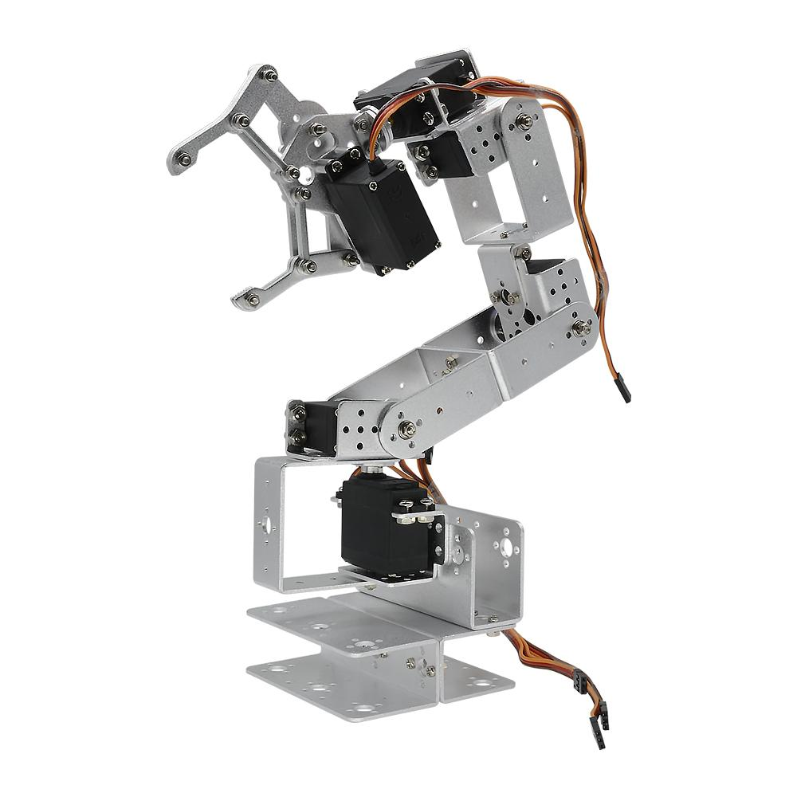
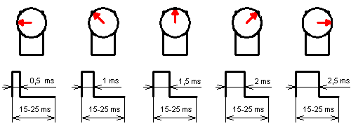

This is a small project aimed at building a 6 DOF robot arm using inexpensive components, and control it through a Raspberry Pi.

# This is a fork
Originally a fork from [Stawo's Robot Arm](https://github.com/stawo/robot-arm), I decided to use an Arduino Nano as an I2C  ADC as I already had some available. This project  used the AD1015 ADC, and I thought of using an MCP3008 instead, but at the time of writing, an Arduino is just as cheap and slightly more convenient as it's sold on a board with easy to connect headers.

# Table of Contents
- [This is a fork](#this-is-a-fork)
- [Table of Contents](#table-of-contents)
- [BOM](#bom)
- [Power Supply considerations](#power-supply-considerations)
- [Some Theory](#some-theory)
  - [Controlling Servo Motors](#controlling-servo-motors)
  - [Servo motor feedback](#servo-motor-feedback)
- [Raspberry Pi configuration](#raspberry-pi-configuration)
  - [Raspberry Pi set up](#raspberry-pi-set-up)
  - [Controlling servo motors with Raspberry Pi and the PWM Driver PCA9685](#controlling-servo-motors-with-raspberry-pi-and-the-pwm-driver-pca9685)
  - [Simple GUI](#simple-gui)
  - [Reading the feedback from servo motors with Raspberry Pi](#reading-the-feedback-from-servo-motors-with-raspberry-pi)
  - [Arduino Code](#arduino-code)
  - [Inverse Kinematics](#inverse-kinematics)

# BOM
List of components used:
* Raspberry Pi 3 Model B+
* 16GB Micro SD card
* Robot Arm mechanical kit (AliExpress, see the picture for reference as there are many sellers)
* 6x Servo Motors (4x MG996R + 2x Carson CS-3. Ideally they should all be the same model but I had the Carson available)
* 12V Switching Power Supply: Any 12V power supply will do as long as it can deliver at least 2A (24W)
* 2x LM2596 based converter (1x USB output, 1x Wire terminal output)
* PCA9685 16 Channel 12 Bit PMW Servo Driver [Wiki](http://wiki.sunfounder.cc/index.php?title=PCA9685_16_Channel_12_Bit_PWM_Servo_Driver). There are many clones available.
* Servo Extension Cables
* female-female Dupont jumper wire cable
* Other wiring as needed
* (TODO) Enclosure for all boards and connectors
* Logic level shifter board

Tools:
* Multimeter
* Electric screwdriver
* Monitor/Keyboard/Mouse/Wi-Fi adapter/SD Adapter for Micro SD for the Raspberry Pi

#  Power Supply considerations
This circuit needs 3 sources of power for each of the 3 main components:
* The Raspberry Pi
* The 6 Servo Motors
* The Arduino/ADC

You might be able to power everything straight from the 5V pin on the Raspberry, but that's a bit risky. The main reason to have different power supplies is that the servos can draw a significant amount of current (especially under load), which might either exceed the RPi 5V pin output or cause significant other issues (brownouts and voltage drops leading to servos misbehaving). From quick tests, I found that the servos can draw around 300mA for a standard movement, and almost twice that if they get stalled or are under significant load. Since we have 6 servos we can easily reach over 2A during some movements, hence the need to separate the power supplies (the RPi will draw about 500mA, possibly more if we add lots of processing in the background)

. I want to build this with all the electronics in a single panel attached to the robot base, with a single DC Barrel 12V input. Therefore, the  power supply consists of:

- One 12V DC power supply. Since the LM2596 converter has a variable input of 6-40V, you might even get away with an 18V laptop power supply
- An LM2596 board with a USB connector that will power the raspberry pi
- Another LM2596 board with a standard screw terminal that will power the servos.
- The arduino will be powered by the Raspberry Pi 5V pin.

|**NOTE**|
|--------|
|The servo motors have to be physically modified in order to read the internal potentiometer. If you use the MG996r, it's the middle pad out of the 3 in a row you can see closest to the wall. [This video](https://www.youtube.com/watch?v=w7qRs6tvxlM) is for a different model of servo but it shows the process 

# Some Theory
Before moving on, it is necessary to understand how the various elements work, especially parts like servo motors, in order to avoid problems (i.e., avoid burning stuff like me due to too much excitement and not knowing how things work!).

## Controlling Servo Motors
A servo motor is usually controllable through PWM (Pulse Width Modulation). Specifically, its arm position depends on the width (or length) of the pulse applied to it.
A PWM signal encodes a ratio. The ratio of on to off is needed to get all the information; on alone is not enough. 
As a concrete example, PWM might be running at a frequency of 200Hz (or a period of 5ms). A 50% of maximum power signal (also known as Duty Cycle) would be on for 2.5ms, and off for 2.5ms. 
Change the frequency to 1000Hz, and hence the period becomes 1ms. The 50% duty cycle would now be 0.5ms on, and 0.5ms off. That PWM signal still encodes the same 50% power information.

Usually, servos can rotate between 0 and 180°. So we have to adjust the pulse length in between. A length of 1.5ms (7.5% duty cycle) thus gives an angle of 90°. And all at precisely 50 times per second (50Hz).
This diagram summarizes how a servo motor is controlled through PWM:

In my case I use the Lewan Soul LD-27MG, which has the following specs:
* working voltage: 6-7.4 V
* min working current: 1 A
* angle: between 0° and 270°
* Pulse Period: 20ms
  thus Frequency: 50Hz
* Pulse Width Range: between 0.5ms and 2.5ms
  thus Duty Cycle: between 2.5% and 12.5%

Conversion table:
Angle   | Pulse Width (ms) | Duty Cycle (%)
------- | ---------------- | --------------
0°      | 0.5              | 2.5
45°     | 0.8333           | 4.1666
90°     | 1.1666           | 5.8333
135°    | 1.5              | 7.5
180°    | 1.8333           | 9.1666
225°    | 2.1666           | 10.8333
270°    | 2.5              | 12.5

Links:
* https://www.teachmemicro.com/raspberry-pi-pwm-servo-tutorial/
* https://tutorials-raspberrypi.com/raspberry-pi-servo-motor-control/

## Servo motor feedback
Normal servo motors do not provide a feedback to the control board (in our case, the Raspberry Pi).
They simply take the PWM generated and do their best to fulfill the "request".

For our robot arm this is not ideal, because the arm could get stuck while doing a movement (for example, we try to push the arm against the table), and this leads to a stall of the servo motor.
Stalling a servo motor will damage it and the control board, as it will increase the current load (see https://electronics.stackexchange.com/questions/274721/how-does-blocking-a-servo-dc-motor-break-it).

Especially in my setup, once the PCA9685 control board sends the PWM signal to the servo motor, there is no way to stop the PWM signal or turn off the servo, and the board will burn out (it happened to me) if the servo stalls.

To understand if a servo motor is in stall (or, alternatively, is operating correctly), we need a feedback from it.
We can achieve this by tapping the potentiometer inside the servo motor, and read the measured voltage.

After modifying the servo motors, we have an extra pin that will output a voltage directly related to the position. This voltage varies for each servo model:
- MG996r seems to go between 0.7V and 2.9V approximately
- CS-3 goes lower, between 0.6V and about 1.8V

This

**Modifying Servos**

Links:
* https://www.youtube.com/watch?v=w7qRs6tvxlM
* https://learn.adafruit.com/analog-feedback-servos/using-feedback
* https://electronics.stackexchange.com/questions/214761/how-to-measure-servo-potentiometer

# Raspberry Pi configuration

I'm running the Raspberry Pi using Raspbian. For the pinout, there's this excellent website: [RPI pinout](https://pinout.xyz/)

## Raspberry Pi set up
To be able to control servo motor through the PCA9685 controller, we need to perform the following steps:
1. Activate the I2C interface in the Raspberry
    * run the command
    ``sudo raspi-config``
    * go to “Interfaces”, select “I2C”, select “Yes”
2. Configuring Raspberry Pi for I2C.
    * Install the following packages:
    ``sudo apt-get install python-smbus``
    ``sudo apt-get install i2c-tools``
    * Add the following lines to ``/etc/modules``:
    ``i2c-dev``
    ``i2c-bcm2708``
    * Reboot the Pi
3. Check that the PCA9685 controller is properly connected and it's set to its default address:
  ``sudo i2cdetect -y 1``
  It should show up at 0x40 (binary 1000000) as follows:
  
4. Connect the PCA9685 controller as in the diagram
5. [optional] Create/activate the Python environment of your choice
6. Install the library https://github.com/adafruit/Adafruit_Python_PCA9685 by running the command:
  ``sudo pip install adafruit-pca9685``

Links:
* https://learn.adafruit.com/adafruit-16-channel-servo-driver-with-raspberry-pi/configuring-your-pi-for-i2c
* https://learn.adafruit.com/adafruit-16-channel-servo-driver-with-raspberry-pi/using-the-adafruit-library

## Controlling servo motors with Raspberry Pi and the PWM Driver PCA9685
**[TO DO]**

## Simple GUI
**[TO DO]**

## Reading the feedback from servo motors with Raspberry Pi
**[TO DO]**

## Arduino Code
**[TO DO]**

## Inverse Kinematics
**[TO DO]**